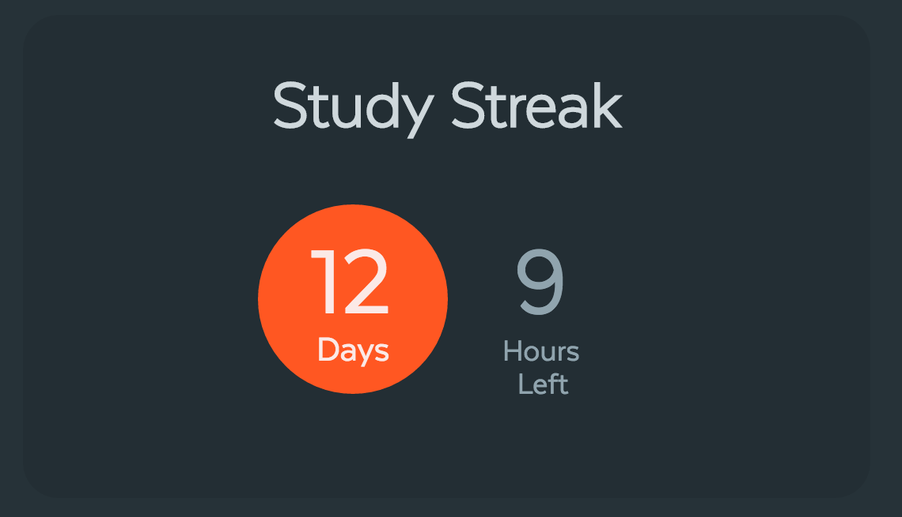

Something I recently found difficult to get my head around was how timezones work. It’s one of those things you tend to avoid as much as possible, however, I realised that there was quite a big flaw in my website, Revisify, that needed addressing.

For those of you who don’t know, Revisify is a tool I built to help students study. Students can create questions, test themselves and progress. I have one feature available, study streaks, which count the number consecutive days a student has been studying.

_Here’s what the study streak looks like._

Now, this must be quite simple to program right? I’ve stored all the dates/times a student has tested themselves in a database, now all I need to do is get today’s date, and work backwards through the database, check if yesterday’s date is there and if so, check the previous day’s date and continue on until one of the dates is not available. However, something which I forgot about was that this would not work for students who live in a timezone other than GMT. Why? Because the server is based in the UK. The way I programmed the server is that every time a student tests themselves, the server will get the server’s date/time and logs it into the database.

## Coordinated Universal Time

I found out that there is something called *Coordinated Universal Time (UTC) *time. Don’t ask me why it isn’t shortened down to UTC instead of CUT, [you can read why here.](https://www.timeanddate.com/time/utc-abbreviation.html) UTC is basically a global standard for timezones and it has the exact same time as GMT.

* The time in the UK as represented in UTC would simply be UTC+00:00, because as I said, UTC time is the same as GMT.

* If we wanted the time in Australia, it would be represented as UTC+09:30 as it is 9 hours and 30 minutes ahead of the time in the UK.

* The time in Hawaii would be UTC-10:00 as it is 10 hours behind of the time in the UK.

## Dealing with UTC Server

Okay so back to Revisify. By knowing this, if we stored the date/time in UTC+00:00, we could then convert that to the local time of the student is located. Luckily since I only have 1 server which happens to be based in the UK, the dates in the database are already in UTC+00:00. However, I still needed to change some Python code on the server:

```python
from datetime import datetime

# This gets the server time. If I moved the server to say Australia, it would not get UTC time.
date = datetime.now()

# This gets UTC time regardless of where the server is located.
date = datetime.utcnow()
```

## Dealing with UTC Client Side

Now that I ‘officially’ store UTC dates/times in the database, I need to convert these correctly to the student’s local time. This can be difficult to program yourself but luckily there’s a fantastic Javascript Library called [Moment.js](http://momentjs.com/) which takes out **a lot **of the strain of converting timezones. Here’s how easy it was for me to convert the UTC date/times that I got from the database into the local time of the student’s computer:

```javascript
// Server's UTC datetime
var utcDate = '2016-12-20 14:56:51'

// Client's local datetime
var localDate = moment.utc(utcDate).local()
```

That simple line of code is all that is needed for the client to get the right date. This library has a lot more functions but I will leave that for another time.

Back to the study streak, I updated the code so that the server sends the dates and some Javascript on the client side calculates the study streak. The final result is [available here](https://gist.github.com/PavSidhu/8a3b04bc7f16ba6a2eb38f6803254fda) with some annotations as to how it works. You can also see it below:

```javascript
// Values for dates are received from the server
dates = [];

for (i=0; i <= dates.length-1; i++) {
  var date = date[i];
  var localDate = moment.utc(date).local().format('DDMMYY');

if (i === 0) {
    var today = moment().format('DDMMYY');
    var yesterday = moment().format('DDMMYY');

    if (localDate === today) ||
        localDate === yesterday) {
        streak += 1;
    }
  }
  else {
    var previousDate = moment.utc(dates[i-1]).local().format('DDMMYY');
    var previousDateYesterday = moment.utc(dates[i-1]).local().subtract(1, 'days').format('DDMMYY');

    if (localDate !== previousDate) {
      if (localDate === previousDateYesterday) {
        streak += 1;
      }
      else {
        break;
      }
    }
  }
}
```

There we have it. I have found that now I’ve used timezones once, it isn’t as difficult, but still somewhat confusing if I think about it in too much detail.

If you really want to melt your brain, this YouTube video by Tom Scott explains timezones in much more detail, enjoy (or not).

`youtube:https://www.youtube.com/embed/-5wpm-gesOY`
