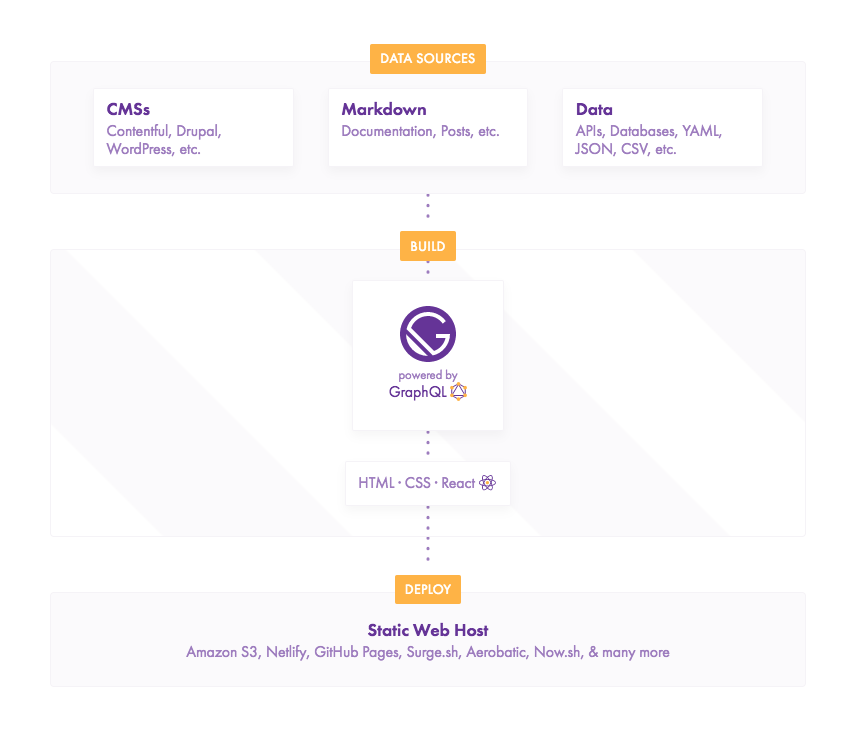
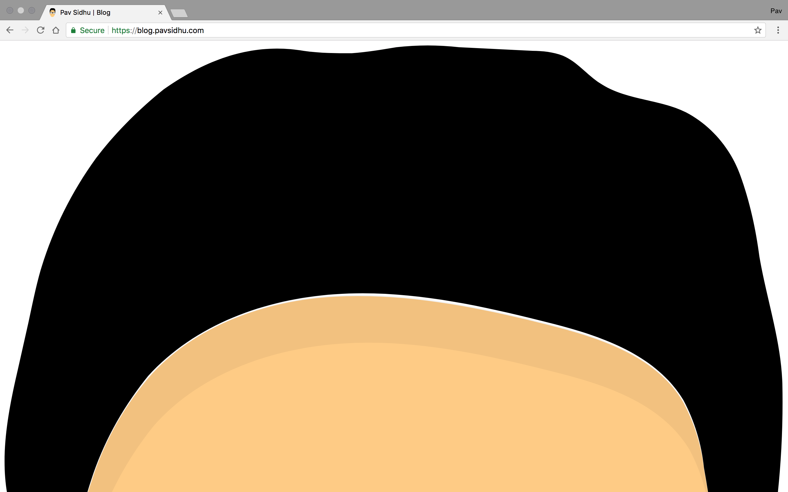

# Can you name a more iconic duo? 🤔

Years ago, when I would build a static website, I wouldn't use any fancy frameworks or build tools. The only thing I would bring into my projects would be jQuery or if I was feeling extra fancy I would use Sass.

Nowadays, we have tools like Gatsby and Netlify which greatly improve the experience of building static websites. Rather than thinking about boilerplate and configuration (looking at you Webpack) you can just focus on your application.

I wouldn't hesitate to say that the Gatsby and Netlify flow is the best programming experience I've ever had. Let me explain why.

## Gatsby

Gatsby is a static site generator that uses React. Everything is configured out of the box including React, Webpack, Prettier and more.

Since Gatsby builds on top of React, you get all the benefits of React such as its performance, components, JSX, React library ecosystem and a large community (React is nearing 100,000 stars on GitHub 😱).

If you haven't used React before there is a learning curve but there are plenty of well written tutorials that makes learning React very accessible. Not to mention the [official React documentation](https://reactjs.org/) is very well written.

For many static websites like my blog, I need to use external data sources (my actual blog posts) during the build process. Gatsby provides support for many forms of data, including Markdown, APIs, Databases and CMSs like WordPress. To access this data, Gatsby uses GraphQL.

_Taken straight from the Gatsby website_

All my blog posts are in Markdown, so I'm using a Gatsby plugin [gatsby-transformer-remark](https://www.gatsbyjs.org/packages/gatsby-transformer-remark/?=gatsby-transformer-remark) that allows you to query your Markdown files using GraphQL. It also converts your Markdown file to HTML straight out of the box like magic. I simply need to use the following GraphQL query to access a specific post:

```graphql
query BlogPostByPath($path: String!) {
  markdownRemark(frontmatter: { path: { eq: $path } }) {
    frontmatter {
      title
      date(formatString: "Do MMMM YYYY")
    }
    html
  }
}
```

Using this query, I access the data through my props like so:

```jsx
  const BlogPost = ({ props: { data: { markdownRemark } } }) => (
    <div>
      <h1>{markdownRemark.title}</h1>
      <p>{markdownRemark.date}<p>
      <div dangerouslySetInnerHTML={{ __html: markdownRemark.html }} />
    </div>
  )
```

If you understand GraphQL, accessing data from Markdown using Gatsby feels right at home. If GraphQL is new to you, it does add yet another thing to learn, however, the documentation on using GraphQL with Gatsby has plenty of information and code snippets that you can use.

If you are building a simple blog like mine and there are only one or two queries you need to make, there are Gatsby starter kits that already set up gatsby-transformer-remark and all the querying for you. To speed up development I used one called [gatsby-starter-blog-no-styles](https://github.com/noahg/gatsby-starter-blog-no-styles/).

I am a huge fan of styled-components so I used it when building this blog. I did encounter an issue with styling my blog posts since there was no way to specify to gatsby-transformer-remark how to style your components. Instead I had to use plain CSS for styling. I would love to see something like the following in `gatsby-config.js`:

```javascript
import styled from 'styled-components'

const Header = styled.h1`
  font-size: 24px;
  color: #333333;
`

module.exports = {
  plugins: [
    {
      resolve: 'gatsby-transformer-remark',
      options: {
        h1: Header,
      },
    },
  ],
}
```

Aside from the actual usage of Gatsby, the [official documentation](https://www.gatsbyjs.org/docs/) is very well written and up to date. Each guide in the docs explain concepts of Gatsby so well, it's likely that in most cases you won't need to check any third party source of information.

The only difficulty I came across when using Gatbsy was when I deployed my website I had a FOUC (flash of unstyled content). To fix this issue I found that upgrading Gatsby from 1.8.12 to 1.9.250 fixed the issue. I'm not too sure why this fixed it, I assume it must have been an internal issue with Gatsby.

_I mean who really wants to see my forehead?_

## Netlify

Usually, when building a static website, I'll use GitHub pages because it's free and fairly easy to set up. Although I still think GitHub pages is a great tool, Netlify takes the process one step further to make the developer experience even more efficient.

Once you've [hooked up Netlify to your repo](https://www.netlify.com/blog/2016/02/24/a-step-by-step-guide-gatsby-on-netlify/), each push to your GitHub repository, automatically builds your website, according to the static site generator you're using, and deploys it to production.

Although I currently only use Netlify for static site hosting, it supports cloud functions, domain management (with SSL), form submissions, a/b testing and more.

Besides features, Netlify's web interface is clean and easy to use. Coming from using AWS a lot in past projects, the difference is night and day. While AWS has it's advantages being highly configurable, the large portion of us developers are unlikely to use this functionality. When I first used S3 or Lambda (Amazon's static file and cloud function services) I would spend a considerable amount of time looking up Amazon's difficult and sometimes out of date documentation. There is a whole lot of unneeded complexity and Amazon jargon when using AWS which is why Netlify is a breath of fresh air. It's one of those services that _just_ works.

The best part about Netlify is that it's free. If you're in a large team or need more resources for cloud functions, form submissions and more they do have paid options. If you plan on building a small blog like me, it's unlikely you'll need to pay for anything.

## TL;DR

Gatsby and Netlify are the easiest way to build and publish a static website. Period.

If you would like an example of how to build a blog using Gatsby, the code for my blog is [available on GitHub](https://github.com/pavsidhu/blog).